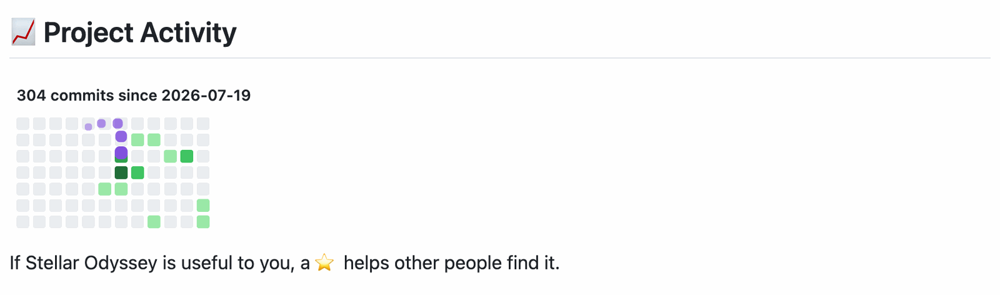
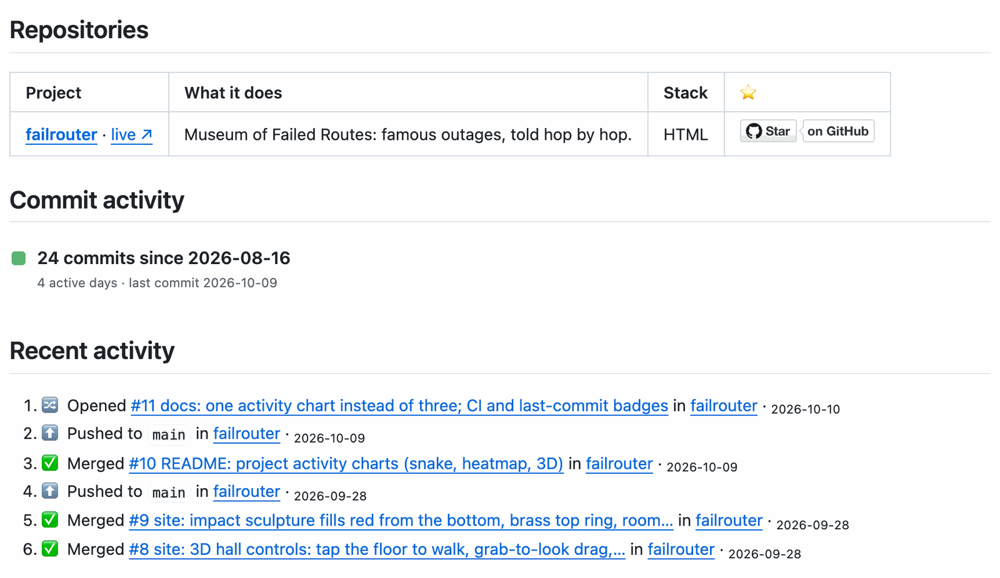
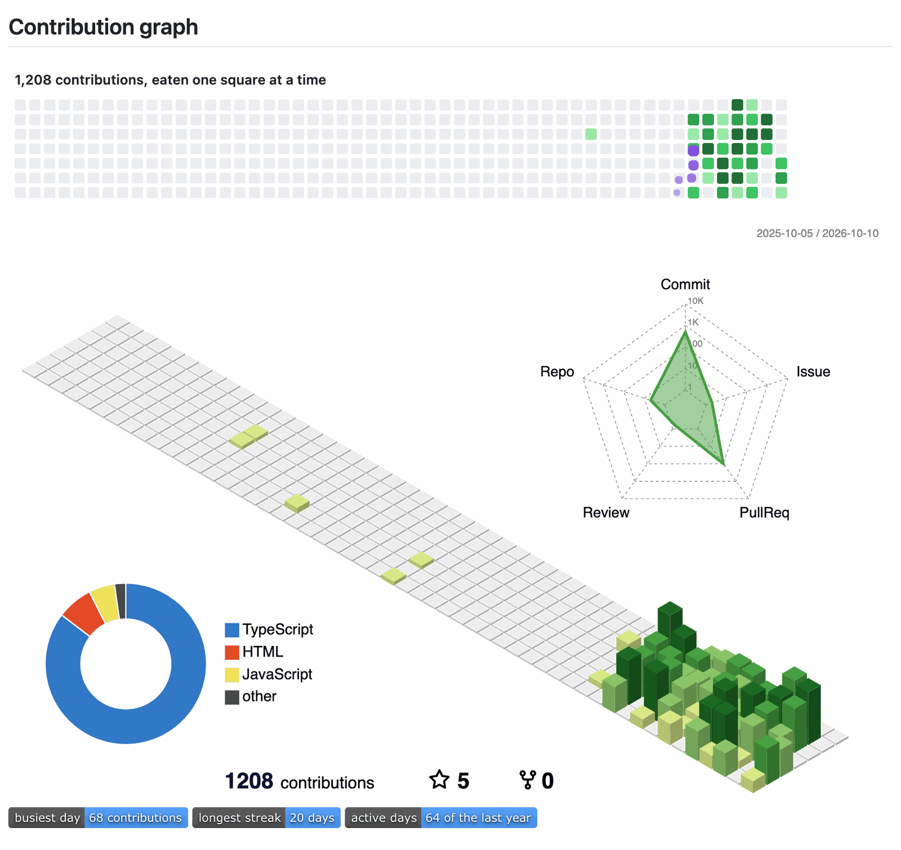
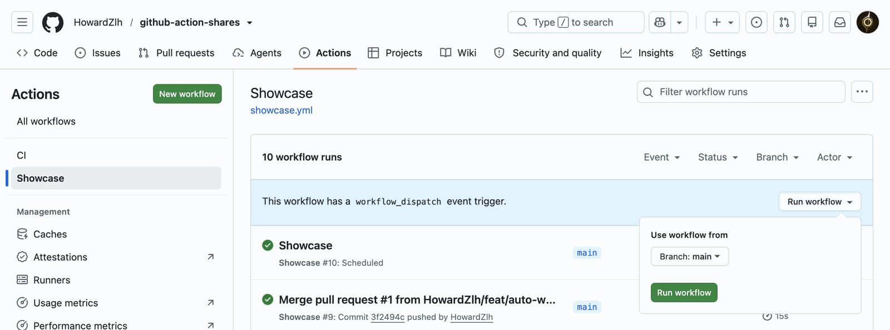
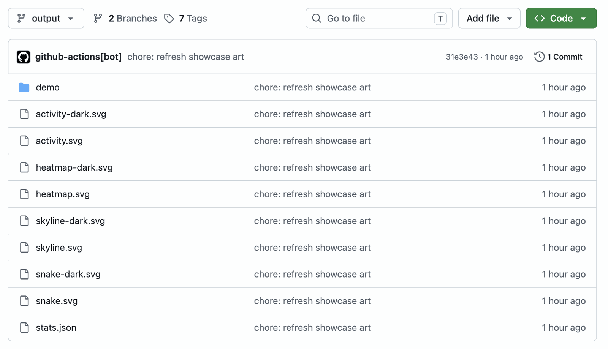
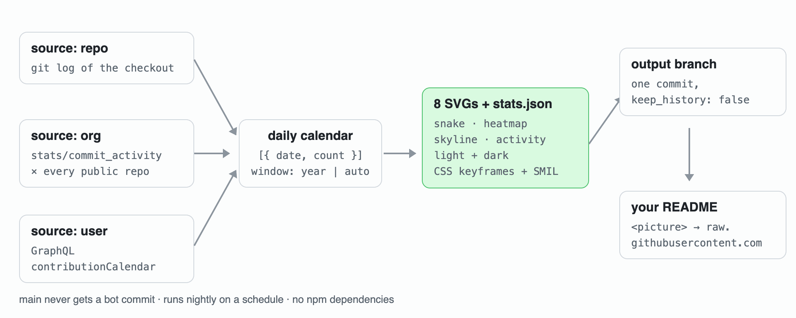

# Animated GitHub README stats for any user, organization or repository

**English** | [中文](./README.zh-CN.md)

A GitHub Action that draws a contribution heatmap, a snake that eats it, and a 3D skyline, as animated SVGs, for **a single repository or a whole organization** as well as for a user account. It also keeps a star-sorted project table and a recent-activity list in your README up to date. No dependencies, MIT.

[](https://github.com/HowardZlh/github-action-shares/actions/workflows/ci.yml)
[](LICENSE)
[](https://github.com/HowardZlh/github-action-shares)

<picture>
  <source media="(prefers-color-scheme: dark)" srcset="https://raw.githubusercontent.com/HowardZlh/github-action-shares/output/demo/snake-dark.svg">
  
</picture>

That snake is eating a year of [@HowardZlh](https://github.com/HowardZlh)'s contributions, redrawn every night by [`showcase.yml`](.github/workflows/showcase.yml). A two-month-old repo gets a grid that starts at its first commit instead of a year of empty squares, and a one-line summary until it has ten active days.

**Jump to**: [What you get](#what-you-get) · [On real pages](#on-real-pages) · [Quick start](#quick-start-for-a-repository) · [Profile](#for-your-profile-readme) · [Organization](#for-an-organization-profile) · [Inputs](#inputs) · [Tutorial](docs/en/tutorial.md) · [How it works](#how-it-works)

## What you get

Every SVG comes in a light and a dark version, so it matches whichever GitHub theme the visitor uses.

| Output | Repo | Org | User | Made by |
|:--|:-:|:-:|:-:|:--|
| Snake heading straight for the nearest active day | ✅ | ✅ | ✅ | this action |
| Heatmap that fills in week by week | ✅ | ✅ | ✅ | this action |
| 3D isometric skyline with busiest day and longest streak | ✅ | ✅ | ✅ | this action (users can also use [github-profile-3d-contrib](https://github.com/yoshi389111/github-profile-3d-contrib)) |
| `activity.svg`: the snake, or a one-line summary while a project has fewer than 10 active days | ✅ | ✅ | ✅ | this action |
| `stats.json` for live shields badges (busiest day, streak, active days) | ✅ | ✅ | ✅ | this action |
| Project table sorted by stars, with a live Star button per row | — | ✅ | ✅ | this action, `command: readme` |
| Recent activity: releases, merged PRs, new repos, and for orgs who starred what | — | ✅ | ✅ | this action, `command: readme` |

The first three columns matter. GitHub only keeps a contribution calendar for user accounts, so the popular snake and 3D actions can't draw a repository or an organization. This one counts commits from `git log` (one repo) or sums `stats/commit_activity` across every public repo (an org) and draws from that.

All three charts draw the same daily numbers, so put **one** of them in a README; the snake is the one people stop for. The heatmap and skyline below are drawn from the same year as the snake above.

<picture>
  <source media="(prefers-color-scheme: dark)" srcset="https://raw.githubusercontent.com/HowardZlh/github-action-shares/output/demo/heatmap-dark.svg">
  
</picture>

<picture>
  <source media="(prefers-color-scheme: dark)" srcset="https://raw.githubusercontent.com/HowardZlh/github-action-shares/output/demo/skyline-dark.svg">
  
</picture>

## On real pages

Screenshots taken on 2026-10-10, logged out, so this is what a visitor sees.

**A repository.** [stellar-odyssey](https://github.com/HowardZlh/stellar-odyssey#-project-activity) started on 2026-07-19. With `window: auto` its grid is twelve weeks wide instead of fifty-three:

<picture>
  <source media="(prefers-color-scheme: dark)" srcset="docs/images/repo-activity-dark.png">
  
</picture>

**An organization.** [FailRouter](https://github.com/FailRouter) has 4 active days so far, so `activity.svg` is still the one-line summary. The table and the activity list come from `command: readme`:



**A profile.** [HowardZlh](https://github.com/HowardZlh): the snake, the 3D calendar from github-profile-3d-contrib, and three badges reading `stats.json`:

<picture>
  <source media="(prefers-color-scheme: dark)" srcset="docs/images/profile-dark.png">
  
</picture>

## Quick start for a repository

Add `.github/workflows/readme-showcase.yml`:

```yaml
name: README showcase
on:
  schedule: [{ cron: "23 3 * * *" }]
  workflow_dispatch:
permissions:
  contents: write
jobs:
  art:
    runs-on: ubuntu-latest
    steps:
      - uses: actions/checkout@v5
        with: { fetch-depth: 0 }
      - uses: HowardZlh/github-action-shares@v1
        with: { source: repo, git-path: ., window: auto, out-dir: dist }
      - uses: crazy-max/ghaction-github-pages@v5
        with: { target_branch: output, build_dir: dist, keep_history: false }
        env: { GITHUB_TOKEN: "${{ secrets.GITHUB_TOKEN }}" }
```

Run it once: Actions tab → **README showcase** → **Run workflow**.



The run takes 10 to 15 seconds and leaves an `output` branch with the SVGs and `stats.json` in a single bot commit:



Then put this in your README (replace `OWNER/REPO`):

```html
<picture>
  <source media="(prefers-color-scheme: dark)" srcset="https://raw.githubusercontent.com/OWNER/REPO/output/activity-dark.svg">
  
</picture>
```

`activity.svg` is the snake once the repo has 10 active days, and a line like "24 commits since 2026-08-16 · last commit 2026-10-09" before that, so a new project never shows a grid of empty squares. `window: auto` starts the grid at the first commit (at least 8 weeks wide) instead of 53 weeks ago.

The SVGs go to a separate `output` branch. Your default branch never gets a bot commit, so a deploy workflow that runs on `push: main` stays quiet. The full file with comments is in [`examples/repo/`](examples/repo/.github/workflows/readme-showcase.yml).

## For your profile README

The profile example combines two tools: this action for the snake, `stats.json` and the README blocks, and github-profile-3d-contrib for the 3D calendar. GitHub already draws a heatmap under every profile README, so the example doesn't add another. Put two marker pairs in `README.md`:

```md
<!-- SHOWCASE:REPOS:START -->
<!-- SHOWCASE:REPOS:END -->

<!-- SHOWCASE:ACTIVITY:START -->
<!-- SHOWCASE:ACTIVITY:END -->
```

and copy [`examples/profile/`](examples/profile/.github/workflows/profile-showcase.yml). The README job writes nothing that changes every day (no "last updated" timestamp), so it only commits when a star count or an event actually changes.

Running live: [github.com/HowardZlh](https://github.com/HowardZlh).

## For an organization profile

An org's homepage README is `profile/README.md` in the org's `.github` repository. Copy [`examples/org/`](examples/org/.github/workflows/org-showcase.yml). `source: org` sums commits across the org's public repos, and the activity list includes `⭐ someone starred your-repo` lines, which is social proof that a user profile can't show.

Running live: [github.com/FailRouter](https://github.com/FailRouter).

## Inputs

| Input | Default | Used by | Meaning |
|:--|:--|:--|:--|
| `command` | `art` | — | `art` writes SVGs, `readme` rewrites marked README blocks |
| `source` | `repo` | art | `repo`, `org` or `user` |
| `target` | current repo | art | `owner/repo`, org name or login |
| `git-path` | — | art | read commit dates from this checkout instead of the stats API; needs `fetch-depth: 0` |
| `label` | `commits` / `contributions` | art | the noun printed in the SVG titles |
| `window` | `year` | art | `year`: the last 53 weeks. `auto`: from the week of the first active day, at least `min-weeks` wide; use it for repos and orgs younger than a year |
| `min-weeks` | `8` | art | narrowest grid when `window: auto` |
| `min-days` | `10` | art | `activity.svg` is the snake from this many active days on, a one-line summary below it |
| `out-dir` | `dist` | art | where the 8 SVGs and `stats.json` go |
| `readme` | `README.md` | readme | file to rewrite |
| `repos` | — | readme | comma-separated `owner/repo` list for the stars table |
| `org` | — | readme | add every public, non-fork repo of this org to the table |
| `activity` | — | readme | `users:<login>` or `orgs:<org>` |
| `limit` | `8` | readme | max activity lines |
| `skip-repos` | — | readme | `owner/repo` list to leave out of the activity list |
| `token` | `github.token` | both | the default is enough; `source: user` needs it for GraphQL |

`art` writes `heatmap.svg`, `snake.svg`, `skyline.svg`, `activity.svg`, the same four with `-dark`, and `stats.json` with the total, the busiest day, the streaks, the first and last active day and the window. Quote a number from it in a live badge:

```md

```

## How it works



- **Zero dependencies.** Node's built-in `fetch`, `node:test` and string templates. `action.yml` is a composite action that runs `node bin/showcase.mjs`, so there's no `node_modules` to audit or Docker image to pull.
- **Animation without JavaScript.** GitHub serves README images through its camo proxy as ``, where scripts never run. The heatmap and skyline use CSS keyframes, and the snake uses SMIL `<animateMotion>`.
- **The snake only walks where it has to.** It enters from the top-left, always heads for the nearest uneaten square (one cell per step), and leaves through the nearer side; each eaten cell gets one `<animate>` timed to the step the head arrives. A loop lasts 8 to 30 seconds however sparse or busy the year was.
- **Reduced motion is respected.** The CSS animations switch off under `prefers-reduced-motion: reduce`, and the SVG shows the final frame.
- **Readable by screen readers and search engines.** Each SVG has `role="img"`, a `<title>` with the real number ("569 contributions in the last year") and a `<desc>` with the date range.
- **No interactivity in a README, by design of GitHub.** Hover tooltips and drag-to-rotate need scripts or pointer events, and an `` behind camo gets neither. If you want an explorable chart, link the image to a page you host.
- **Nothing that reads as a weakness.** A streak under three days is left out of the text, and a project with fewer than ten active days gets a sentence instead of a mostly empty grid.
- **Quartile colouring**, the way GitHub does it: one 68-contribution day doesn't wash the rest of the year out to the palest green.

The tests run against a throwaway git repository and a fake `fetch`, with no network. `npm run coverage` fails under 90% lines or 80% branches.

```sh
npm test
npm run coverage
node bin/showcase.mjs art --source repo --target me/repo --git . --out dist   # local preview
```

## Tutorial

A step-by-step guide: creating the profile repo, the org `.github` repo, a young repository, dark-mode images, README copy that holds up in search results, and troubleshooting. Read it in [English](docs/en/tutorial.md) or [中文](docs/zh-CN/tutorial.md).

## Used by

- [HowardZlh](https://github.com/HowardZlh), profile README
- [FailRouter](https://github.com/FailRouter), organization profile
- [stellar-odyssey](https://github.com/HowardZlh/stellar-odyssey), scroll from a planet's surface out to the edge of the observable universe, in 3D
- [usage-guard-collector](https://github.com/HowardZlh/usage-guard-collector), Cloudflare usage spike alerts
- [failrouter](https://github.com/FailRouter/failrouter), a museum of famous outages

Using it somewhere? Open a PR that adds your repo to this list.

If one of these SVGs ends up in your README, a ⭐ helps the next person find the action.

## License

[MIT](LICENSE) © 2026 Howard ([@HowardZlh](https://github.com/HowardZlh))
